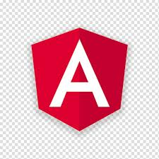
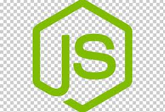

# Inventory and Workforce Management System

<p align="center">
  
  
  
  
</p>

<p align="center">
  <b>Built with the MEAN Stack – MongoDB, Express, Angular, and Node.js</b>
</p>

[](https://angular.io)
[](https://www.typescriptlang.org/)
[](https://restfulapi.net/)
[](https://nodejs.org/)
[](https://expressjs.com/)
[](https://www.mongodb.com/)
[](https://developer.mozilla.org/en-US/docs/Web/HTML)
[](https://developer.mozilla.org/en-US/docs/Web/CSS)

> **Admin Dashboard and Employee Interface**  
> This version connects to a live **MongoDB database** using a **Node + Express backend**.  
>  
> 💡 If you prefer a simpler setup (no MongoDB required), check out the Angular-only version here:  
> 👉 [Inventory-and-Workforce-Dashboard-angular](https://github.com/DMGsilverfish/Inventory-and-Workforce-Dashboard-angular)

---

## ✨ What It Does
The **Inventory and Workforce Management System** is a demo Angular application designed to:

- ✅ Provide **role-based logins** (Admin vs Employee)  
- ✅ Showcase **protected routes** using Angular Guards  
- ✅ Demonstrate basic **JSON-based authentication**  
- 🔄 Planned: Enhanced UI/UX, integration with a real backend
- ❌ Employees can work up to **2 shifts per day**

---

## 🏗️ Tech Stack
- **Angular 20** – Modern framework for SPAs  
- **TypeScript** – Strong typing for maintainability
- **RESTful API** – Standardized client-server communication
- **Node.js** – JavaScript runtime for the backend  
- **Express.js** – Lightweight web framework for APIs 
- **HTML5 & CSS** – Simple UI, mobile-friendly  

---

## 🔑 Demo Logins
- **👤 Employee**
  - Username: Alice Johnson
  - PIN: 1234

- **🛠️ Admin**
  - Username: Diana Prince
  - PIN: 4321

## 🚀 Getting Started

### Prerequisites
- **Node.js** (v18 or newer) - [Download Node.js](https://nodejs.org/en)  
- **Angular CLI 20**

### Run Locally
```bash
# Clone the repository
git clone https://github.com/DMGsilverfish/inventory-and-workforce-dashboard.git
cd inventory-and-workforce-dashboard

# ----------------------
# 1️⃣ Start the backend
# ----------------------
# Navigate to the backend folder (cd backend)
node server.js
# The backend API will run on http://localhost:3000

# ----------------------
# 2️⃣ Start the frontend (new terminal)
# ----------------------
ng serve
# Open your browser and go to http://localhost:4200
